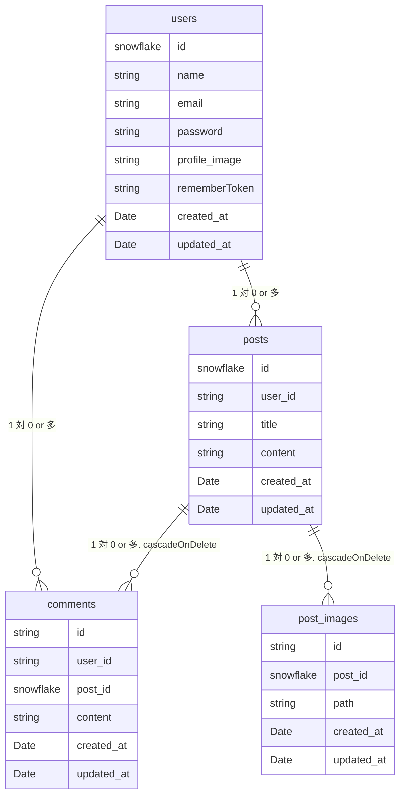

# Modan Post Server Program

## このプログラムについて
簡易的なWeb掲示板アプリのサーバープログラムです。
これに対応するクライアントプログラムもあわせて開発しました。→ https://github.com/YomogiBeta/ModanPostClient

サーバープログラムはLaravalをライブラリとして選定し、PHPにて開発しています。
これを選定した理由は次のとおりです。

- webのバックエンドを開発するのに枯れた技術でありながら、継続的にアップデートが行われている。dockerで環境を簡単に用意できるようになっていたのも魅力の１つだ。

## 始め方
### Required
- docker
- composer
- Makefile

### Start Commands
```
composer install
cp .env.example .env
make up
make migrate
```

### Stop Commands
```
make down
```

2回目以降は`make up`のみで良い

## 特徴
- ✅ ライブラリで実装を一新しています。
- ✅ サーバープログラムはリクエストに対してページではなく結果のJSONを返す設計になっています。
- ✅ CSRF対策のためのToken、CORSなど適切なセキュリティ対策が施されています。
- ✅ [クライアント](https://github.com/YomogiBeta/ModanPostClient)の機能を提供できるようなRESTFUL APIを実装しています。 
- ✅ eloquentを使用し実装しています。
- ✅ POSTMANを利用しデバックしています。 

### 工夫点 
Controllerをはじめとして、必要に応じて各リソースにあわせたResourceクラス、各リソースの操作に合わせたRequestクラス、Policyの定義など、Controllerに処理をベタ張りするのではなく、laravalが築いてきた作法に基づいて実装するようにしました。

## データベースのER図


## Licence
このプログラムをコピーし、ホスティングすることは禁止します。ただし、ホスティングされたサーバーに端末が最大１台まで
しか接続しない場合、これを許可します（ローカル環境での立ち上げを許可するという意味）
