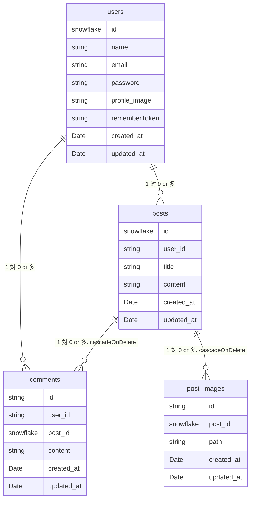

# Modan Post Server Program

## このプログラムについて  ( https://modanpost.com )
このプログラムは応用プログラミング(Web)の最終レポート用に作成された、Web掲示板アプリのサーバープログラムです。
これに対応するクライアントプログラムもあわせて開発しました。→ https://github.com/YomogiBeta/ModanPostClient

サーバープログラムはLaravalをライブラリとして選定し、PHPにて開発しています。
これを選定した理由は次のとおりです。
- PHP利用にあたって、授業でも取り扱ったPHPの知識が利用できる。
- ORMを利用して適切にデータベースにアクセスするためのテーブル設計、Model設計などで、授業でも取り扱ったSQLの知識が利用できる。
- webのバックエンドを開発するのに枯れた技術でありながら、継続的にアップデートが行われている。dockerで環境を簡単に用意できるようになっていたのも魅力の１つだ。

## 始め方
### Required
- docker
- composer
- Makefile

### Start Commands
```
composer install
cp .env.example .env
make up
make migrate
```

### Stop Commands
```
make down
```

2回目以降は`make up`のみで良い

## 授業で取り組んだblogサイトからの改良点・工夫点(サーバープログラム目線)

### 改良点
- ✅ ライブラリで実装を一新しています。
- ✅ サーバープログラムはリクエストに対してページではなく結果のJSONを返す設計になっています。
- ✅ CSRF対策のためのToken、CORSなど適切なセキュリティ対策が施されています。
- ✅ [クライアント目線](https://github.com/YomogiBeta/ModanPostClient)で述べたような機能を提供できるようなRESTFUL APIを実装しています。 
- ✅ eloquentを使用し実装しています。
- ✅ POSTMANを利用しデバックしています。 
- ✅ DigitalOceanにホスティング。mainブランチに変更があれば即座に本番に反映される。

### 工夫点 
Controllerをはじめとして、必要に応じて各リソースにあわせたResourceクラス、各リソースの操作に合わせたRequestクラス、Policyの定義など、Controllerに処理をベタ張りするのではなく、laravalが築いてきた作法に基づいて実装するようにしました。また、クライアント側と通信するにあたって、cookieやCORSの設定は少し難しかったです。

## データベースのER図


## Licence
このプログラムをコピーし、ホスティングすることは禁止します。ただし、ホスティングされたサーバーに端末が最大１台まで
しか接続しない場合、これを許可します（ローカル環境での立ち上げを許可するという意味）

ただし、応用プログラミング(Web)の最終レポートとして評価するのに必要な場合に限り、
私の応用プログラミング(Web)の担当教授様及び、TA様に限ってはこの限りではないものとします。
